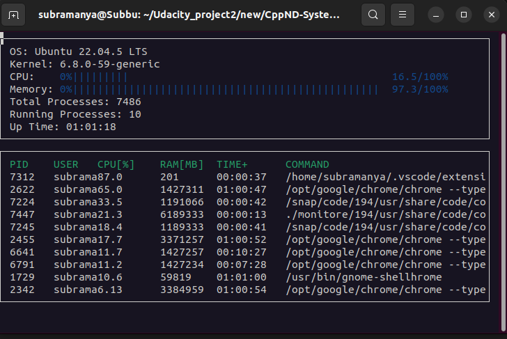

# CppND-System-Monitor

This project is a part of the Udacity course for System Monitor Project in the Object Oriented Programming Course of the [Udacity C++ Nanodegree Program](https://www.udacity.com/course/c-plus-plus-nanodegree--nd213). 

## ncurses
[ncurses](https://www.gnu.org/software/ncurses/) is a library that facilitates text-based graphical output in the terminal. This project relies on ncurses for display output.

install ncurses in Linux environment: `sudo apt install libncurses5-dev libncursesw5-dev`

## Instructions

1. Clone the project repository: `https://github.com/Subramanyanataraj/System-Monitor.git`

2. Build the project: 
    `cd systemMonitor` &&

    `mkdir build` && 

    `cmake ..` && 

    `make`

3. Run the resulting executable inside build folder: `./monitor`

